# HTTP Message Signatures (RFC 9421) for Go


[](https://sonarcloud.io/summary/new_code?id=igor-pavlenko_http-message-signatures-rfc9421-go)
[](https://sonarcloud.io/summary/new_code?id=igor-pavlenko_http-message-signatures-rfc9421-go)
[](https://sonarcloud.io/summary/new_code?id=igor-pavlenko_http-message-signatures-rfc9421-go)
[](https://goreportcard.com/report/github.com/igor-pavlenko/http-message-signatures-rfc9421-go)
[](https://sonarcloud.io/summary/new_code?id=igor-pavlenko_http-message-signatures-rfc9421-go)
[](https://opensource.org/licenses/MIT)

A complete Go implementation of [RFC 9421 HTTP Message Signatures](https://datatracker.ietf.org/doc/html/rfc9421) with support for signing, verification, and Content-Digest generation.

## Features

- **Full RFC 9421 Implementation** - Parse, sign, and verify HTTP message signatures
- **6 Signature Algorithms** - RSA-PSS, RSA PKCS#1 v1.5, ECDSA (P-256, P-384), Ed25519, HMAC-SHA256
- **7 Digest Algorithms** - SHA-2, SHA-3, BLAKE2b families
- **Zero External Dependencies** - Only `golang.org/x/crypto` for SHA-3/BLAKE2b
- **High-level Sign/Verify API** - `pkg/httpsig` helpers for common HTTP flows
- **Streaming Support** - O(1) memory for large message bodies
- **RFC 8941 Parser** - Complete Structured Field Values implementation

## Installation

```bash
go get github.com/igor-pavlenko/http-message-signatures-rfc9421-go
```

**Requires:** Go 1.21+

## Quick Start

### High-level API (Signer/Verifier)

```go
package main

import (
    "net/http"
    "time"

    "github.com/igor-pavlenko/http-message-signatures-rfc9421-go/pkg/httpsig"
    "github.com/igor-pavlenko/http-message-signatures-rfc9421-go/pkg/parser"
)

func main() {
    req, _ := http.NewRequest("POST", "https://example.com/api/resource", nil)
    req.Header.Set("Content-Type", "application/json")

    components := []parser.ComponentIdentifier{
        {Name: "@method", Type: parser.ComponentDerived},
        {Name: "@path", Type: parser.ComponentDerived},
        {Name: "content-type", Type: parser.ComponentField},
    }

    key := []byte("0123456789abcdef0123456789abcdef")

    signer, _ := httpsig.NewSigner(httpsig.SignerOptions{
        Algorithm:  "hmac-sha256",
        Key:        key,
        KeyID:      "my-key",
        Components: components,
        Created:    time.Now(),
        Expires:    time.Now().Add(5 * time.Minute),
    })
    _, _ = signer.SignRequest(req)

    verifier, _ := httpsig.NewVerifier(httpsig.VerifyOptions{
        Key:       key,
        Algorithm: "hmac-sha256",
        RequiredComponents: []parser.ComponentIdentifier{
            {Name: "@method", Type: parser.ComponentDerived},
            {Name: "@path", Type: parser.ComponentDerived},
        },
        ParamsValidation: parser.SignatureParamsValidationOptions{
            RequireCreated:          true,
            CreatedNotOlderThan:     5 * time.Minute,
            CreatedNotNewerThan:     time.Minute,
            RejectExpired:           true,
            ExpiresNotBeforeCreated: true,
        },
    })

    _, _ = verifier.VerifyRequest(req)
}
```

### Sign and verify a response (high-level API)

```go
package main

import (
    "net/http"

    "github.com/igor-pavlenko/http-message-signatures-rfc9421-go/pkg/httpsig"
    "github.com/igor-pavlenko/http-message-signatures-rfc9421-go/pkg/parser"
)

func main() {
    key := []byte("0123456789abcdef0123456789abcdef")
    signer, _ := httpsig.NewSigner(httpsig.SignerOptions{
        Algorithm:  "hmac-sha256",
        Key:        key,
        Components: []parser.ComponentIdentifier{{Name: "@status", Type: parser.ComponentDerived}},
    })

    resp := &http.Response{StatusCode: 200, Header: http.Header{}}
    resp.Header.Set("Content-Type", "application/json")
    _, _ = signer.SignResponse(resp, nil)

    verifier, _ := httpsig.NewVerifier(httpsig.VerifyOptions{
        Key:       key,
        Algorithm: "hmac-sha256",
        RequiredComponents: []parser.ComponentIdentifier{
            {Name: "@status", Type: parser.ComponentDerived},
        },
    })
    _, _ = verifier.VerifyResponse(resp, nil)
}
```

### Configuration

SignerOptions:
- `Label`: signature label (default `sig1`)
- `Components`: covered components (order matters)
- `Algorithm`, `Key`: required for signing
- `KeyID`, `Nonce`, `Tag`: optional metadata
- `Created`, `Expires`: set explicit timestamps
- `DisableCreated`, `DisableAlgorithm`: omit `created`/`alg` params
- `Now`: override clock if `Created` is zero

VerifyOptions:
- `Label`: specific signature label (required when multiple signatures are present)
- `RequiredComponents`: enforce coverage
- `AllowedAlgorithms`: allowlist of algorithms
- `Key`, `Algorithm`: fixed verification key/alg
- `KeyResolver`: dynamic key lookup (mutually exclusive with `Key`)
- `ParamsValidation`: created/expires policy and skew tolerance
- `Limits`: Structured Field parsing limits

### Key resolution (dynamic keys)

```go
package main

import (
    "context"
    "fmt"
    "net/http"
    "time"

    "github.com/igor-pavlenko/http-message-signatures-rfc9421-go/pkg/httpsig"
    "github.com/igor-pavlenko/http-message-signatures-rfc9421-go/pkg/parser"
)

func main() {
    resolver := httpsig.KeyResolverFunc(func(ctx context.Context, label string, params parser.SignatureParams) (interface{}, string, error) {
        if params.KeyID == nil {
            return nil, "", fmt.Errorf("missing keyid")
        }
        key := lookupKey(*params.KeyID)
        return key, "hmac-sha256", nil
    })

    verifier, _ := httpsig.NewVerifier(httpsig.VerifyOptions{
        KeyResolver: resolver,
        ParamsValidation: parser.SignatureParamsValidationOptions{
            RequireCreated:      true,
            CreatedNotOlderThan: 5 * time.Minute,
        },
    })

    req, _ := http.NewRequest("GET", "https://example.com/api/resource", nil)
    _, _ = verifier.VerifyRequest(req)
}

func lookupKey(keyID string) []byte {
    return []byte("0123456789abcdef0123456789abcdef")
}
```

### Low-level API (manual headers)

Sign:

```go
package main

import (
    "net/http"
    "time"

    "github.com/igor-pavlenko/http-message-signatures-rfc9421-go/pkg/base"
    "github.com/igor-pavlenko/http-message-signatures-rfc9421-go/pkg/parser"
    "github.com/igor-pavlenko/http-message-signatures-rfc9421-go/pkg/sfv"
    "github.com/igor-pavlenko/http-message-signatures-rfc9421-go/pkg/signing"
)

func main() {
    req, _ := http.NewRequest("POST", "https://example.com/api/resource", nil)
    req.Header.Set("Content-Type", "application/json")

    components := []parser.ComponentIdentifier{
        {Name: "@method", Type: parser.ComponentDerived},
        {Name: "@path", Type: parser.ComponentDerived},
        {Name: "content-type", Type: parser.ComponentField},
    }

    created := time.Now().Unix()
    keyID := "my-key"
    algID := "hmac-sha256"
    params := parser.SignatureParams{
        Created:   &created,
        KeyID:     &keyID,
        Algorithm: &algID,
    }

    msg := base.WrapRequest(req)
    sigBase, _ := base.Build(msg, components, params)

    key := []byte("0123456789abcdef0123456789abcdef")
    alg, _ := signing.GetAlgorithm(algID)
    sig, _ := alg.Sign(sigBase, key)

    sigInputDict := &sfv.Dictionary{
        Keys: []string{"sig1"},
        Values: map[string]interface{}{
            "sig1": sfv.InnerList{
                Items: []sfv.Item{
                    {Value: "@method"},
                    {Value: "@path"},
                    {Value: "content-type"},
                },
                Parameters: []sfv.Parameter{
                    {Key: "created", Value: created},
                    {Key: "keyid", Value: keyID},
                    {Key: "alg", Value: algID},
                },
            },
        },
    }
    sigDict := &sfv.Dictionary{
        Keys: []string{"sig1"},
        Values: map[string]interface{}{
            "sig1": sfv.Item{Value: sig},
        },
    }

    sigInput, _ := sfv.SerializeDictionary(sigInputDict)
    sigHeader, _ := sfv.SerializeDictionary(sigDict)

    req.Header.Set("Signature-Input", sigInput)
    req.Header.Set("Signature", sigHeader)
}
```

Verify:

```go
package main

import (
    "fmt"
    "net/http"
    "time"

    "github.com/igor-pavlenko/http-message-signatures-rfc9421-go/pkg/base"
    "github.com/igor-pavlenko/http-message-signatures-rfc9421-go/pkg/parser"
    "github.com/igor-pavlenko/http-message-signatures-rfc9421-go/pkg/sfv"
    "github.com/igor-pavlenko/http-message-signatures-rfc9421-go/pkg/signing"
)

func VerifyRequest(req *http.Request, key []byte) error {
    parsed, err := parser.ParseSignatures(
        req.Header.Get("Signature-Input"),
        req.Header.Get("Signature"),
        sfv.DefaultLimits(),
    )
    if err != nil {
        return fmt.Errorf("parse error: %w", err)
    }

    sig, ok := parsed.Signatures["sig1"]
    if !ok {
        return fmt.Errorf("signature \"sig1\" not found")
    }

    if err := parser.ValidateSignatureParams(sig.SignatureParams, parser.SignatureParamsValidationOptions{
        RequireCreated:      true,
        CreatedNotOlderThan: 5 * time.Minute,
        CreatedNotNewerThan: time.Minute,
    }); err != nil {
        return fmt.Errorf("params error: %w", err)
    }

    msg := base.WrapRequest(req)
    sigBase, err := base.Build(msg, sig.CoveredComponents, sig.SignatureParams)
    if err != nil {
        return fmt.Errorf("build error: %w", err)
    }

    algID := "hmac-sha256"
    if sig.SignatureParams.Algorithm != nil {
        algID = *sig.SignatureParams.Algorithm
    }
    alg, _ := signing.GetAlgorithm(algID)
    return alg.Verify(sigBase, sig.SignatureValue, key)
}
```

### Generate Content-Digest

```go
package main

import (
    "fmt"

    "github.com/igor-pavlenko/http-message-signatures-rfc9421-go/pkg/digest"
)

func main() {
    body := []byte(`{"hello": "world"}`)

    // Compute digest
    d, _ := digest.ComputeDigest(body, digest.AlgorithmSHA256)

    // Format as header value
    header, _ := digest.FormatContentDigest(map[string][]byte{
        digest.AlgorithmSHA256: d,
    })

    fmt.Println(header)
    // Output: sha-256=:X48E9qOokqqrvdts8nOJRJN3OWDUoyWxBf7kbu9DBPE=:
}
```

### Streaming Digest (O(1) Memory)

```go
package main

import (
    "io"
    "os"

    "github.com/igor-pavlenko/http-message-signatures-rfc9421-go/pkg/digest"
)

func main() {
    file, _ := os.Open("large-file.bin")
    defer file.Close()

    // Create streaming hasher
    h, _ := digest.NewDigester(digest.AlgorithmSHA512)

    // Stream through hasher (constant memory)
    io.Copy(h, file)

    // Get digest
    digestBytes := h.Sum(nil)
}
```

## Packages

| Package | Description |
|---------|-------------|
| `pkg/httpsig` | High-level sign/verify helpers |
| `pkg/parser` | Parse Signature-Input and Signature headers |
| `pkg/base` | Build canonical signature base from HTTP messages |
| `pkg/signing` | Sign and verify with RFC 9421 algorithms |
| `pkg/digest` | Content-Digest generation and verification |
| `pkg/sfv` | RFC 8941 Structured Field Values parser |

## Supported Algorithms

### Signature Algorithms (RFC 9421 Section 3.3)

| Algorithm ID | Type | Key Type |
|--------------|------|----------|
| `rsa-pss-sha512` | RSA-PSS | *rsa.PrivateKey / *rsa.PublicKey |
| `rsa-v1_5-sha256` | RSA PKCS#1 v1.5 | *rsa.PrivateKey / *rsa.PublicKey |
| `ecdsa-p256-sha256` | ECDSA | *ecdsa.PrivateKey / *ecdsa.PublicKey (P-256) |
| `ecdsa-p384-sha384` | ECDSA | *ecdsa.PrivateKey / *ecdsa.PublicKey (P-384) |
| `ed25519` | EdDSA | ed25519.PrivateKey / ed25519.PublicKey |
| `hmac-sha256` | HMAC | []byte (min 16 bytes, recommended 32) |

### Digest Algorithms (Content-Digest)

| Algorithm ID | Family | Output Size |
|--------------|--------|-------------|
| `sha-256` | SHA-2 | 32 bytes |
| `sha-512` | SHA-2 | 64 bytes |
| `sha-512/256` | SHA-2 | 32 bytes |
| `sha3-256` | SHA-3 | 32 bytes |
| `sha3-512` | SHA-3 | 64 bytes |
| `blake2b-256` | BLAKE2b | 32 bytes |
| `blake2b-512` | BLAKE2b | 64 bytes |

Deprecated algorithms (MD5, SHA-1, etc.) are explicitly rejected.

## Derived Components

All RFC 9421 derived components are supported:

| Component | Description |
|-----------|-------------|
| `@method` | HTTP request method (GET, POST, etc.) |
| `@target-uri` | Full target URI |
| `@authority` | Host and port |
| `@scheme` | URI scheme (http, https) |
| `@request-target` | Request target from request line |
| `@path` | Absolute path component |
| `@query` | Query string with leading `?` |
| `@query-param` | Individual query parameter (requires `name`) |
| `@status` | Response status code |

## API Reference

### parser.ParseSignatures

```go
func ParseSignatures(signatureInput, signature string, limits sfv.Limits) (*ParsedSignatures, error)
```

Parses `Signature-Input` and `Signature` header values into structured data.

### base.Build

```go
func Build(msg HTTPMessage, components []parser.ComponentIdentifier, params parser.SignatureParams) ([]byte, error)
```

Constructs the canonical signature base per RFC 9421 Section 2.5.

### signing.GetAlgorithm

```go
func GetAlgorithm(id string) (Algorithm, error)
```

Returns a signing algorithm by its RFC 9421 identifier.

### digest.ComputeDigest

```go
func ComputeDigest(body []byte, algorithm string) ([]byte, error)
```

Computes a cryptographic digest of the body.

### digest.VerifyContentDigest

```go
func VerifyContentDigest(reader io.Reader, header string, requiredAlgorithms []string) error
```

Verifies Content-Digest header against streaming body (O(1) memory).

## Security

- **Constant-time comparison** for HMAC and digest verification
- **RSA key validation** - minimum 2048 bits required
- **Algorithm rejection** - deprecated algorithms explicitly rejected
- **DoS prevention** - configurable parser limits via `sfv.Limits`

## Benchmarks

Compared against other Go RFC 9421 implementations ([yaronf/httpsign](https://github.com/yaronf/httpsign), [remitly-oss/httpsig-go](https://github.com/remitly-oss/httpsig-go), [common-fate/httpsig](https://github.com/common-fate/httpsig)) on Apple M2 (arm64):

### Performance Summary

| Metric | Sign | Verify |
|--------|------|--------|
| **RSA-PSS-SHA512** | within noise (~0.3%) | 5-14% faster |
| **ECDSA-P256** | 10-16% faster | 2-7% faster |
| **HMAC-SHA256** | 1.9-2.6x faster | 1.6-2.7x faster |
| **Memory usage** | 1.2-1.9x less | 1.2-2.3x less |
| **Allocations** | 1.8-2.9x fewer | 2.0-3.5x fewer |

RSA-PSS signing is dominated by the shared `crypto/rsa` operation itself, so all
four libraries land within noise of each other there. Verify-side memory and
allocation savings are narrower than earlier results because `Verifier` no
longer caches Signature-Input parsing between calls — a correctness fix for
concurrent use (see [benchmarks/README.md](benchmarks/README.md)).

### Efficiency Visualization

```mermaid
gantt
    title Verification Latency (HMAC-SHA256)
    dateFormat  X
    axisFormat %s
    section ns/op
    igor-pavlenko (2168)      :0, 2168
    remitly (3391)      :0, 3391
    common-fate (5241)  :0, 5241
    yaronf (5881)        :0, 5881
```



See [benchmarks/README.md](benchmarks/README.md) for detailed results and methodology.

## Testing

```bash
# Run all tests
go test ./...

# Run with race detector
go test ./... -race

# Run with coverage
go test ./... -coverprofile=coverage.out
go tool cover -html=coverage.out

# Run fuzz tests
go test ./pkg/sfv/... -fuzz=FuzzParseDictionary -fuzztime=30s
go test ./pkg/parser/... -fuzz=FuzzParseSignatures -fuzztime=30s
```

## References

- [RFC 9421: HTTP Message Signatures](https://datatracker.ietf.org/doc/html/rfc9421)
- [RFC 8941: Structured Field Values for HTTP](https://www.rfc-editor.org/rfc/rfc8941.html)
- [RFC 9530: Digest Fields](https://www.rfc-editor.org/rfc/rfc9530.html)

## License

MIT License - see [LICENSE](LICENSE) for details.
